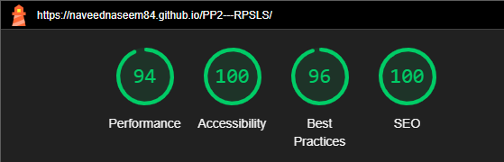

# Rock, paper, scissors, lizard, or Spock (RPSLS) In JavaScript.
RPSLS is an interactive website aimed to provide users of all ages with a seamless experience whilst playing rock, paper, scissors - extended to included lizard and spock poses. 

The intended purpose is to provide a clean take on the all-time classic game, providing a layout that is easy to use and navigate with an option to view the rules on demand. Potential uses for the site can be a quick 5-minute break away from the normal day or played on a device and time suited to the user.

## User Experience (UX)
### User Stories
The following user stories have been created highlighting the needs and requirements for the site. These user stories have formed the foundations for the project which I have kept in mind during all aspects of the design, development, and deployment of the site.

As a user, I want: 
 * To be able to select from rock, paper, scissors, lizard or spock.
 * To see the choices made in a clear way.
 * The option to reset the game and start again at any point. 
 * To easily be able to see if I am winning, losing, or drawn.
 * The option to see the rules when needed.
 * To easily be able to see the outcome of the round/game.
 * To have the option to play on different devices as and when it suits.

### Mind Map: Ideas
Following on from user stories and intended purpose, an initial mind map was created to capture the logic of the game. The purpose of this was provide a high-level understanding of how the user stories could be implemented:

### Wireframe Designs

Following on from the mind map, a wireframe design was created (shown below) with focus given on the user stories. This wireframe illustrates potential elements, styling and content types that could be used. 

### Chosen Colour Scheme

The aim of the chosen colour scheme was to present a modern theme that worked well across all devices in light or dark mode. 
In addition to this, the styling of the results within the game to flow naturally and the changing elements such as score easily identifiable. The colours selected have been done so to reflect this and can be seen in the UX View of Site below.

### UX View of Site
Following on from the wireframe design, a final UX view was designed:

Finalising the UX element of the site provided a clear picture of the finished product, allowing me to then concentrate on the development aspect. This key UX element provided me with a clear reference guide listing all the colours, positions, fonts, and font awesome classes to be used. 

### Pseudo - functions needed (Brainstorm)

Once the UX element had been completed, I mapped out the JavaScript functions needed for the game to perform as needed:

### Process Map

The diagram below maps out the processes and the path taken evaluating the state of the game and the choices made:

## Landing page

The landing page presents the users with a clean, easy to follow layout of the game. The user is welcomed and invited to have fun with clear instructions on what they need to do next (Choose a pose). The site and game are accessible on multiple devices giving a seamless user experience as illustrated below:

_**Image above generated using https://ui.dev/amiresponsive illustrating the responsiveness of the site.**_

### Features

The user is presented with five pose options - Rock, Paper, Scissors, Lizard or Spock (RPSLS). Any can be selected and is reflected by a green outline on the choice hovered:

Once a player (user) choice has been made, the game will be played against a random choice selected for the computer. It will then evaluate who is the winner based on the choices drawn. 

On winning, the player's score is incremented by one, the player congratulated, and the respected elements styled reflecting the win. As the computer score is less than the players score, this is styled to reflect:

On losing, the computer's score is incremented by one, the player commiserated, and again the respected elements are styled. If the computer score is higher than the player score, it is displayed as follows: 

Like the winning/losing states, if the round is a draw the respective elements are styled and the player notified of the  outcome:

If both player and computer scores are drawn, the elements are styled to illustrate this:

Regardless of the outcome from the round, the player and randomly chosen computer choice will be shown: 

The current version of the game allows for the user to play ten rounds. Each time a selection is made, the "tries left" element will be subtracted by one. 

Once this reaches zero, the game is over, the pose buttons are hidden from view and a summary of the round given:

The "restart" button resets the game back to default values and can be done at any time. Once a game is over, restart is required to play again.

In addition to this, the player also has the option to view the rules of the game in a convenient toggle option with minimum disruption:

## Testing

The following testing was conducted:

| Criteria       | Details              |
| ---------------------- |--------------------------:| 
| Desktop browsers:      | Chrome                     | 
|                        | Mozilla Firefox            | 
|                        | Edge                       | 
|                        | Safari                     | 
| Mobile browsers:       |Chrome                      | 
|                        |Safari                      |    
| Resolutions:           |                            | 
| desktop                |1366 x 768 to 1920 x 1080   | 
| mobile                 |375 x 667 to 1440 x 3120    |  
| Devices used:          |                            | 
|                        |Samsung S24 Ultra           | 
|                        |Samsung A32 5G              | 
|                        |iPhone 14 Pro               |  

**Results:**
 
The testing above found no issues in performance or accessibility and I believe the site meets the requirements of the user stories and its intended purpose. 
### Bugs 
* **Issue 1:** The score/choice area was not displaying correctly on certain desktop resolutions. The text overflowed off the screen, and the only way for it to be seen was to use the scroll option. This massively affected the user experience of the game.

  * **Fix:** The margin and padding were adjusted on the affected elements to prevent this from occurring. Once completed, a re-test found no further issues.

* **Issue 2:** The game was incorrectly calculating the outcome and not updating the score and game status message correctly. 

  * **Fix:** Using the console.log, the issue was isolated to the if statement within the playGame function meaning only the first element of the statement was being executed. This was corrected following the syntax and re-tested with no further issues. 

### Validation Testing

The site has been tested with the following:

* HTML
   * No errors returned when running the official W3C validator on all three pages [W3C HTML Validator ](https://validator.w3.org/nu/?doc=https%3A%2F%2Fnaveednaseem84.github.io%2FPP2---RPSLS%2F)
* CSS
   * No errors were found when running the official jigsaw Validator tool on all three pages [(Jigsaw) Validator](https://jigsaw.w3.org/css-validator/validator?uri=https%3A%2F%2Fnaveednaseem84.github.io%2FPP2---RPSLS%2F&profile=css3svg&usermedium=all&warning=1&vextwarning=&lang=en)
* JavaScript
    * No significant errors were returned when checking the JavaScript  code using [(JS Hint)](https://jshint.com/)
    * The following metrics were returned:

    

### Manual Testing

The following manual testing was carried out to confirm that the game performed as required and results matched the expected output. 

| Test | Test Step/Action                    |Input Type   |Expected                      |Result                                                        | Pass/Fail|
| :----:|:-----------------------------------|:-----------:|:-----------------------------|:-------------------------------------------------------------|:--------:| 
| 1     |Rock, Paper,Scissors,Lizard or Spock|Click        |See player selection          |Player selection shown                                        |Pass      | 
| 2     |As Above                            |Click        |Random choice for computer    |Random choice for computer shown.                             |Pass      | 
| 3     |As Above                            |Click        |Determine if player won.      |Player won - UX updated to reflect.                           |Pass      | 
| 4     |As Above                            |Click        |Determine if player lost.     |Player lost - UX updated to reflect.                          |Pass      | 
| 5     |As Above                            |Click        |Determine if player drew.     |Draw - UX updated to reflect.                                 |Pass      | 
| 6     |As Above                            |Click        |Increment winner's score.     |Incremented - UX updated to reflect.                          |Pass      |
| 7     |As Above                            |Click        |GameOver once tries used up.  |GameOver reached when tries at 0. UX updated to show results. |Pass      | 
| 8     |Restart                             |Click        |Restart the game.             |Game restarted - UX updated with no values.                   |Pass      |
| 9     |Rules                               |Click        |Display rules.                |Rules displayed/hidden on toggle.                             |Pass      |
| 10    |Mobile version                      |Touch        |Tests 1-9.                    |Test 1-9 satisfied.                                           |Pass      |
|       |                                    |             |                              |                                                              |          |

### Accessibility/Performance
Lighthouse in devtools produced the following results:

## Future Developments

There are two potential future developments for this project.

1. Introduce a difficulty level - reflected in the number of tries available before the game is over.
2. A scores table which is automatically updated once a game is complete.

## Site Production, Deployment and Contribution  

### Site production

The site was created using Gitpod’s VS Code workspace environment with all the relevant files and folder structures created within. To deploy to GitHub, the following commands were carried out in the command line terminal to commit and push the changes to the GitHub repository: 

1 `git add .`- (Staging the changes in the current working tree ready to be committed).

2 `git commit -m 'Meaningful commit message"` - (The working tree is prepared with an upload message).

3 `git push` - (changes are pushed out up to the GitHub repository).

### Deployment

The site was deployed to GitHub pages. The steps to deploy are as follows:
1.	Go to the Settings tab of your GitHub repo.
2.	On the left-hand sidebar, in the Code and automation section, select Pages.
3.	Make sure:  
    * Source is set to 'Deploy from Branch'.
    * Main branch is selected.
    *	Folder is set to / (root).
4.	Under Branch, click Save.
5.	Go back to the Code tab. Wait a few minutes for the build to finish and refresh your repo which will show the deployment has completed with a green tick at the top:

6.	On the right-hand side, in the Environments section, click on 'github-pages'.
7.	Click View deployment to see the live site.

The live link to the site can be found here: [Rock Paper Scissors Lizard Spock.](https://naveednaseem84.github.io/PP2---RPSLS/)

### Contribution

I welcome any contributions/recommendations/changes to the project. To do this, the github repository would need to be forked from github and downloaded locally so it can be worked on. 

Github has provided step by step instructions on how to do this [here.](https://docs.github.com/en/get-started/exploring-projects-on-github/contributing-to-a-project#forking-a-repository)

## Technologies and tools Used
### Languages used
* HTML

* CSS

* JavaScript

### Frameworks, Libraries and Programs Used
* #### Google Fonts: [Google Orbitron font](https://fonts.google.com/specimen/Orbitron) and [Google Inria Sans font](https://fonts.google.com/specimen/Inria+Sans)

  * The Orbitron and Inria Sans fonts was imported into the style sheet (style.css) and used throughout the project.

* #### Font Awesome: [Font awesome](https://fontawesome.com/)

  * The poses, reset and rules icons were placed used font awesome. The classes used are listed in the UX section.

* #### Git/Gitpod:

  * Gitpod’s workspace was used using the VSCode online editor using git to push to GitHub using version control. 

* #### GitHub:

  * GitHub has been used to store the version control repository for the project and provide a live working external link once deployed.

* #### Figma: [Figma: The Collaborative Interface Design Tool](https://figma.com/)

  * Figma has been used to create the RPSLS logo, the process map and the UX illustrations of the site.

* #### Pixelied: [Pixeled](https://pixelied.com/convert/jpg-converter/jpg-to-webp)
  * Pixelied was used to optimise the logo for web use. 

* #### favicon.io: [favicon.io](https://favicon.io/favicon-converter/)
  * Use to create the favicons from an image (Image credited below)
  
* The code has been formatted using the built in "format document" option within the GitHub VS Code environment using the recommended "beautify" extension.

## Credits
### Content
* The image used for the favicon was taken from: [Flat Icon.](https://www.flaticon.com/free-icon/rock-paper-scissors_6831874?term=rock+paper+scissors&page=1&position=3&origin=tag&related_id=6831874) 

  * This was converted using favicon.io (link in programs used above).

* The JavaScript Event Listener for when DOM loads to listen for clicks on all the buttons was adapted from the [Love Maths CI project](https://learn.codeinstitute.net/courses/course-v1:CodeInstitute+LM101+3/courseware/2d651bf3f23e48aeb9b9218871912b2e/78f3c10a937c4fe09640c7c0098d16bd/) and developed further as needed.

 * The rules for the game are taken from [The Big BANG Theory Wiki](https://bigbangtheory.fandom.com/wiki/Rock,_Paper,_Scissors,_Lizard,_Spock).

### General
* The following resources have been used as a general properties guide for HTML, CSS and JavaScript built in functions:

  * [MDN Web Docs](https://developer.mozilla.org/en-US/docs/Web/JavaScript) 
  * [W3Schools](https://www.w3schools.com/) 
  
## Overall Credit
A huge thank you to Code Institute for the learning and lesson material which has been amazing and my fellow students on Slack for their support! 

## Personal Summary

